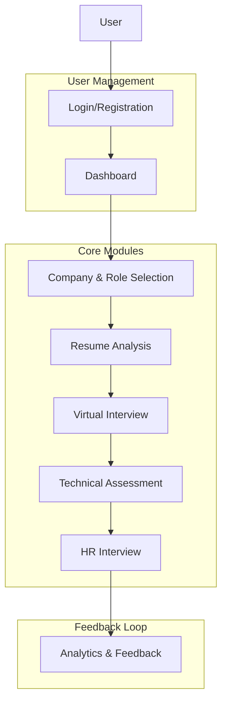
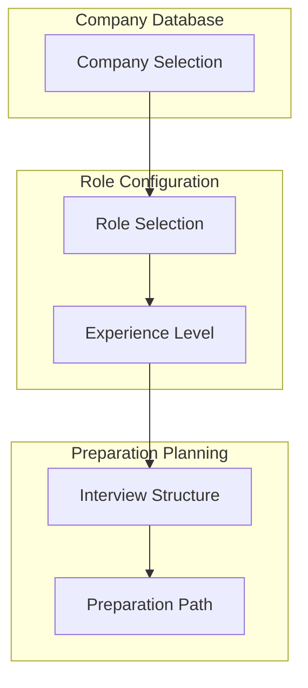
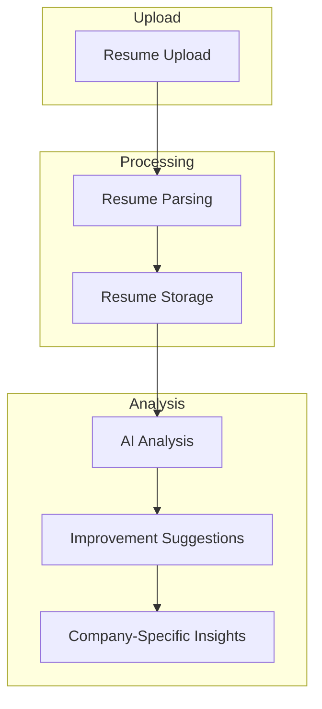
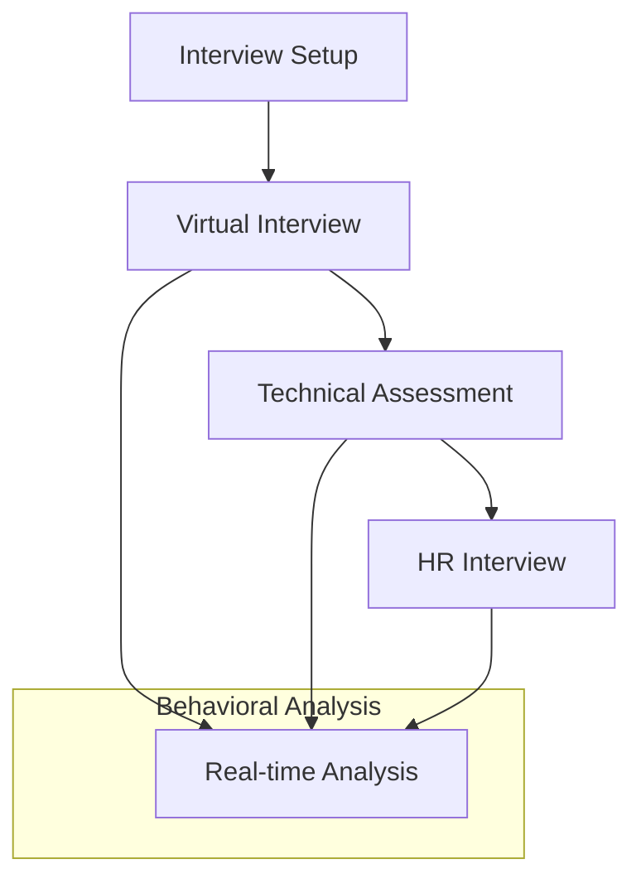
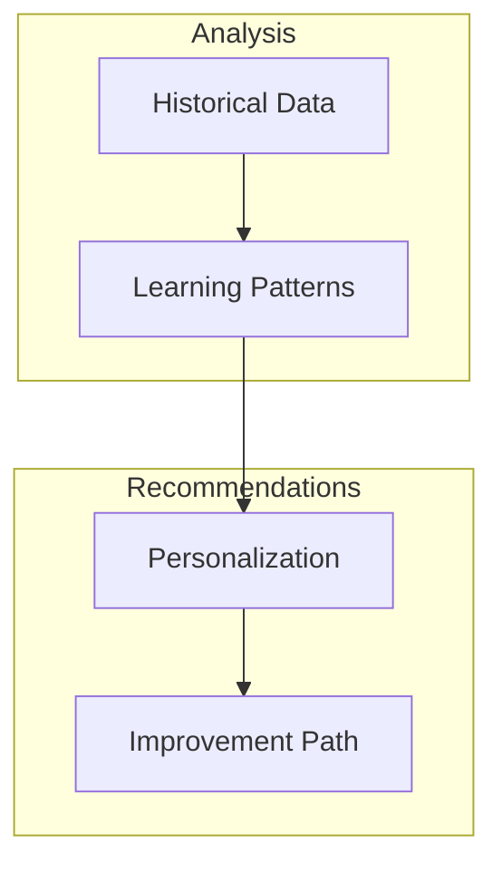

# AI-Powered Interview Preparation System (AIPS) - Comprehensive Todo List

This document outlines a structured approach to building the AI-Powered Interview Preparation System (AIPS) as described in the project documentation. The todo list is organized by phases, with each phase containing detailed tasks and implementation guidelines.

## System Overview

## User Flow

The AIPS system follows a sequential flow where users progress through different modules in a logical order:

1. **Initial Access**
   - On startup, the system displays a login/registration form
   - New users register with email, password, and basic profile information
   - Existing users log in with credentials
   - Upon successful authentication, users are directed to their dashboard

2. **User Dashboard**
   - First-time users are prompted to select a target company and role
   - The dashboard provides navigation to all system modules
   - Progress indicators show completion status of each module

3. **Module Progression**
   - Company & Role Selection → Resume Analysis → Virtual Interview → Technical Assessment → HR Interview → Analytics & Feedback
   - Each module unlocks after completing the previous one
   - Users can revisit completed modules to refine their preparation

4. **Feedback Loop**
   - After each module, users receive feedback and improvement suggestions
   - Analytics dashboard updates with new data after each completed activity

## Phase 1: Foundation - User Management & System Setup

### 1.1 Project Setup 
- [x] Initialize project repository with Git
- [x] Set up React 18 frontend with Vite
- [x] Configure Tailwind CSS for styling
- [x] Set up Express.js backend with TypeScript
- [x] Configure SQLite database with Prisma ORM
- [x] Implement JWT-based authentication
- [x] Configure ESLint and Prettier for code quality
- [ ] Set up Docker for isolated code execution environment (for technical assessment)

### 1.2 User Management Module 
- [x] Design and implement user registration form
- [x] Create login functionality with JWT authentication
- [x] Create basic user dashboard
- [x] Implement session management and authentication state persistence
- [x] Complete dashboard design with navigation to all system modules
- [x] Implement password reset functionality
- [x] Design user profile management interface
- [x] Implement user settings and preferences
- [x] Set up local storage for user data persistence
- [x] Design first-time user onboarding flow with company selection prompt
- [x] Create module access control based on user progress

### 1.3 Database Schema 
- [x] Design basic user profile schema
- [x] Create company and role schema
- [ ] Design interview session schema
- [ ] Implement technical assessment results schema
- [ ] Create behavioral analysis metrics schema
- [x] Design progress tracking and analytics schema
- [x] Implement user flow state tracking schema

## Phase 2: Company & Role Selection Module

### 2.1 Company Database
- [x] Create database schema for major tech companies (TCS, Infosys, Microsoft, Google, Flipkart, Amazon)
- [x] Design company profile interface with logos and basic information
- [x] Implement company selection interface with search functionality

### 2.2 Role Configuration
- [x] Design role/position selection interface for each company
- [x] Implement experience level selection (New Graduate/Fresher, Junior, Mid, Senior)

## Phase 3: Resume Analysis

### 3.1 Resume Upload Interface
- [x] Create resume upload interface with drag-and-drop functionality
- [x] Implement file type validation and size restrictions
- [x] Design upload progress indicators
- [x] Create resume preview functionality
- [x] Implement resume storage in database with hybrid local/server approach
- [x] Design resume version management interface
- [x] Create resume deletion and replacement functionality

### 3.2 Resume Parser
- [x] Implement resume upload interface with drag-and-drop functionality
- [x] Add file validation for PDF and DOCX formats
- [x] Create parsing engine for PDF using PDF.js
- [x] Create parsing engine for DOCX using docx-parser
- [x] Implement section identification (Education, Experience, Skills)
- [x] Design format analysis to check resume layout and structure
- [x] Create parsing progress indicators
- [x] Implement error handling for malformed documents

### 3.3 Resume Storage and Version Management
- [x] Design database schema for storing resumes
- [x] Implement resume storage in local database
- [x] Create version management interface
- [x] Add functionality for resume deletion and replacement
- [x] Implement resume comparison between versions
- [ ] Add export functionality for resumes
- [x] Implement hybrid storage approach (local + database)
- [x] Create synchronization mechanism between local and server storage

### 3.4 Resume Analysis System
- [x] Implement initial mockup analysis system for resume evaluation
- [x] Create visualization for resume strengths and weaknesses
- [x] Design loading indicators for analysis process
- [x] Implement progress tracking during analysis
- [x] Create mechanism to store analysis results in both local storage and database
- [x] Document Processing Integration
  - [x] Implement PDF.js for PDF parsing
  - [x] Integrate Mammoth for DOCX files
  - [x] Add text extraction for TXT files
  - [x] Add fallback text extraction for problematic files
- [x] Gemini API Integration
  - [x] Set up environment and API key configuration
  - [x] Create robust error handling for API calls
  - [x] Implement sanitization for input to prevent prompt injection
  - [x] Add validation for response format and content

### 3.5 AI-Powered Analysis
- [x] Replace manual analysis with Gemini API integration
- [x] Enhanced Resume Processing
  - [x] Section identification (Education, Experience, Skills)
  - [x] Contact information extraction
  - [x] Project and achievement parsing
  - [x] Technical skills categorization
- [x] Smart Analysis System
  - [x] Design comprehensive analysis prompts
  - [x] Create role-specific evaluation criteria
  - [x] Implement company culture matching
  - [x] Add experience level assessment
- [x] Advanced Scoring System
  - [x] Generate detailed section-wise scores
  - [x] Calculate skill match percentages
  - [x] Assess experience relevance
  - [x] Evaluate project impact
  - [x] Implement ATS scoring and optimization
- [x] Feedback Generation
  - [x] Create actionable improvement points
  - [x] Generate skill enhancement suggestions
  - [x] Provide format optimization tips
  - [x] Create "Continue to Virtual Interview" button to guide users to next phase
  - [ ]Send all info of user resume to phase 4

## Phase 4: Interview Modules

### 4.1 Interview Setup & UI
- [x] Design modern interview interface
  - [x] Company branding integration
  - [x] Role-specific customization
  - [x] Experience level display
  - [x] Professional UI/UX elements
- [x] Create information dashboard
  - [x] Resume data integration
  - [x] Interview flow overview
  - [x] Expected duration display
- [x] Implement device setup
  - [x] Camera/microphone permissions
  - [x] Device testing interface
  - [x] Network status check
  - [x] System compatibility verification
- [x] Design interview guidelines
  - [x] Company-specific preparation tips
  - [x] Technical requirements checklist
  - [x] Behavioral expectations guide

### 4.2 Virtual Interview Module
- [ ] Implement interview flow management
  - [ ] Default progression (Virtual → Technical → HR)
  - [ ] Optional module selection
  - [ ] Session state management
- [ ] Create question generation system
  - [ ] Resume-based questions using Gemini
  - [ ] Company-specific behavioral questions
  - [ ] Dynamic follow-up generation
- [ ] Design answer evaluation
  - [ ] Response timing tracking
  - [ ] Communication assessment
  - [ ] Answer completeness check
- [ ] Implement interviewer interaction
  - [ ] Natural conversation flow
  - [ ] Professional tone maintenance
  - [ ] Smooth transitions between topics
- [ ] Create notification system
  - [ ] Warning indicators for technical issues
  - [ ] Interview status notifications (time, next steps)
  - [ ] System alerts (connection, device issues)

### 4.3 Technical Assessment Module
- [ ] Create problem management system
  - [ ] Company-specific question database
  - [ ] Difficulty level categorization
  - [ ] Problem description formatting
- [ ] Implement coding interface
  - [ ] Monaco Editor integration
  - [ ] Multi-language support
  - [ ] Syntax highlighting
  - [ ] Code formatting
- [ ] Design server-side execution
  - [ ] Secure code sandbox
  - [ ] Test case runner
  - [ ] Performance metrics
  - [ ] Memory usage monitoring
- [ ] Create evaluation system
  - [ ] Code quality analysis
  - [ ] Time complexity assessment
  - [ ] Space complexity calculation
  - [ ] Company-specific criteria

### 4.4 HR Interview Module
- [ ] Design HR question bank
  - [ ] Situational questions
  - [ ] Cultural fit assessment
  - [ ] Career goals discussion
- [ ] Implement response evaluation
  - [ ] Answer relevance checking
  - [ ] Professional attitude assessment
  - [ ] Communication style analysis
- [ ] Create salary discussion
  - [ ] Expectation handling
  - [ ] Negotiation simulation
  - [ ] Market rate comparison
- [ ] Design interview closure
  - [ ] Next steps guidance
  - [ ] Question handling
  - [ ] Professional wrap-up

### 4.5 Behavioral Analysis Integration
- [ ] Implement facial analysis
  - [ ] Eye contact tracking
  - [ ] Expression detection
  - [ ] Posture monitoring
- [ ] Create voice analysis
  - [ ] Tone assessment
  - [ ] Speech clarity check
  - [ ] Confidence detection
- [ ] Design real-time processing
  - [ ] Lightweight model implementation
  - [ ] Browser-optimized algorithms
  - [ ] Resource usage optimization
- [ ] Create feedback system
  - [ ] Subtle warning triggers
  - [ ] Performance metrics collection
  - [ ] Post-interview report generation

### 4.6 Results & Analytics
- [ ] Create scoring system
  - [ ] Technical performance metrics
  - [ ] Communication assessment
  - [ ] Behavioral analysis results
- [ ] Design feedback reports
  - [ ] Module-wise performance
  - [ ] Improvement suggestions
  - [ ] Company-specific insights
- [ ] Implement progress tracking
  - [ ] Historical comparisons
  - [ ] Skill development monitoring
  - [ ] Readiness assessment

## Phase 6: Advanced Analytics & Learning System

### 6.1 Historical Analytics
- [ ] Design long-term data storage schema
- [ ] Implement interview history tracking
- [ ] Create performance trend analysis
- [ ] Design learning pattern recognition
- [ ] Implement multi-session comparison
- [ ] Create data archival system
- [ ] Design privacy-compliant data retention

### 6.2 Learning Dashboard
- [ ] Create personalized learning paths
- [ ] Implement skill gap analysis
- [ ] Design company-specific preparation tracks
- [ ] Create practice recommendation engine
- [ ] Implement resource suggestion system
- [ ] Design progress milestones
- [ ] Create achievement system

### 6.3 Improvement System
- [ ] Create adaptive learning algorithms
- [ ] Implement personalized practice sessions
- [ ] Design targeted improvement exercises
- [ ] Create custom preparation plans
- [ ] Implement smart scheduling system
- [ ] Design motivation and reminder system
- [ ] Create performance prediction models

## Phase 7: Deployment & Optimization

### 7.1 Performance Optimization
- [ ] Implement code splitting for faster loading
- [ ] Create progressive web app capabilities
- [ ] Design offline functionality for key features
- [ ] Implement caching strategies for resources
- [ ] Create optimized build process
- [ ] Design lazy loading for non-critical components
- [ ] Implement performance monitoring

### 7.2 Security Implementation
- [ ] Create comprehensive security audit
- [ ] Implement data encryption for sensitive information
- [ ] Design secure authentication flow
- [ ] Create privacy policy and terms of service
- [ ] Implement GDPR compliance features
- [ ] Design data retention policies
- [ ] Create security documentation

### 7.3 Testing & Quality Assurance
- [ ] Implement unit testing for all modules
- [ ] Create integration testing suite
- [ ] Design end-to-end testing scenarios
- [ ] Implement automated testing pipeline
- [ ] Create user acceptance testing plan
- [ ] Design performance testing methodology
- [ ] Implement continuous integration/deployment

### 7.4 Documentation
- [ ] Create comprehensive user documentation
- [ ] Design in-app help system
- [ ] Implement tooltips and guided tours
- [ ] Create developer documentation
- [ ] Design API documentation
- [ ] Implement changelog and release notes
- [ ] Create maintenance documentation