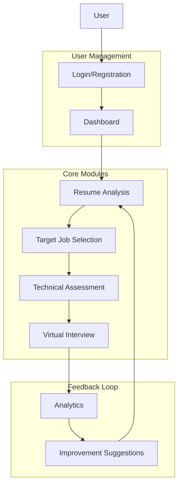
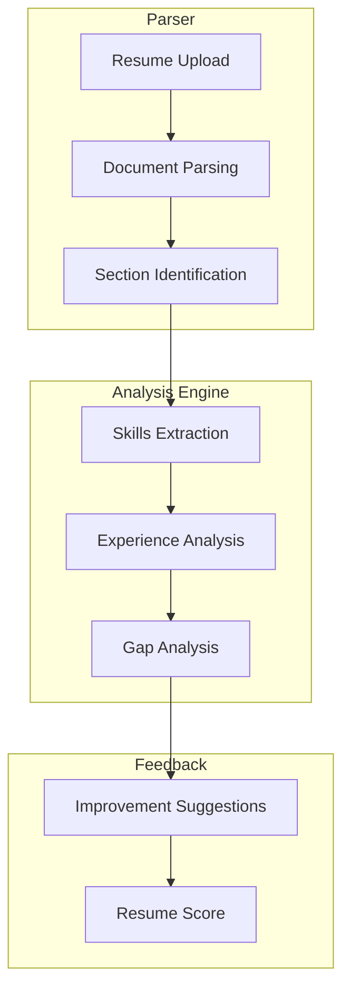
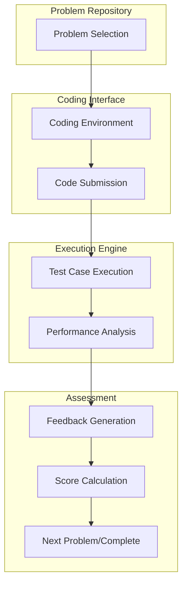
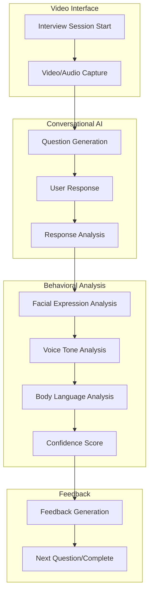

# AI-Powered Interview Preparation System (AIPS) - Comprehensive Todo List

This document outlines a structured approach to building the AI-Powered Interview Preparation System (AIPS) as described in the project documentation. The todo list is organized by phases, with each phase containing detailed tasks and implementation guidelines.

## System Overview

## User Flow

The AIPS system follows a sequential flow where users progress through different modules in a logical order:

1. **Initial Access**
   - On startup, the system displays a login/registration form
   - New users register with email, password, and basic profile information
   - Existing users log in with credentials
   - Upon successful authentication, users are directed to their dashboard

2. **User Dashboard**
   - First-time users are prompted to upload their resume
   - The dashboard provides navigation to all system modules
   - Progress indicators show completion status of each module

3. **Module Progression**
   - Resume Analysis → Target Job Selection → Technical Assessment → Virtual Interview → Analytics
   - Each module unlocks after completing the previous one
   - Users can revisit completed modules to refine their preparation

4. **Feedback Loop**
   - After each module, users receive feedback and improvement suggestions
   - Analytics dashboard updates with new data after each completed activity

## Phase 1: Foundation - User Management & System Setup

### 1.1 Project Setup
- [ ] Initialize project repository with Git
- [ ] Set up React 18 frontend with Vite
- [ ] Configure Tailwind CSS for styling
- [ ] Set up Express.js backend with TypeScript
- [ ] Configure SQLite database with Prisma ORM
- [ ] Implement JWT-based authentication
- [ ] Set up Docker for isolated code execution environment
- [ ] Configure ESLint and Prettier for code quality

### 1.2 User Management Module
- [ ] Design and implement user registration form
- [ ] Create login functionality with JWT authentication
- [ ] Implement password reset functionality
- [ ] Design user profile management interface
- [ ] Create user dashboard with navigation to all system modules
- [ ] Implement user settings and preferences
- [ ] Set up local storage for user data persistence
- [ ] Design first-time user onboarding flow with resume upload prompt
- [ ] Implement session management and authentication state persistence
- [ ] Create module access control based on user progress

### 1.3 Database Schema
- [ ] Design user profile schema
- [ ] Create resume storage schema
- [ ] Design interview session schema
- [ ] Implement technical assessment results schema
- [ ] Create behavioral analysis metrics schema
- [ ] Design progress tracking and analytics schema
- [ ] Implement user flow state tracking schema

## Phase 2: Resume Analysis Module

### 2.1 Resume Parser
- [ ] Implement PDF.js for PDF resume parsing
- [ ] Add docx-parser for Word document parsing
- [ ] Create text extraction logic for different resume formats
- [ ] Implement section identification (Education, Experience, Skills)
- [ ] Design format analysis to check resume layout and structure
- [ ] Create resume upload interface with drag-and-drop functionality
- [ ] Implement file type validation and size restrictions

### 2.2 Resume Analysis Engine
- [ ] Implement entity recognition for skills, job titles, and education
- [ ] Create keyword matching algorithm against job requirements
- [ ] Design gap analysis to identify missing skills
- [ ] Implement resume scoring based on completeness and relevance
- [ ] Create visualization for resume strengths and weaknesses
- [ ] Design loading indicators for analysis process
- [ ] Implement progress tracking during analysis

### 2.3 Resume Improvement Module
- [ ] Design actionable feedback generation system
- [ ] Implement suggestion engine for missing skills or experiences
- [ ] Create template recommendations based on industry standards
- [ ] Implement before/after comparison visualization
- [ ] Design interactive resume editor with real-time feedback
- [ ] Create "Continue to Job Matching" button to guide users to next phase
- [ ] Implement resume version history for tracking improvements

## Phase 3: Target Selection & Job Matching

### 3.1 Job Database
- [ ] Create schema for storing job descriptions
- [ ] Implement job scraping functionality (optional)
- [ ] Design manual job entry interface
- [ ] Create job categorization by industry, role, and required skills
- [ ] Implement job recommendation system based on resume analysis

### 3.2 Skill Matching Engine
- [ ] Implement skill extraction from job descriptions
- [ ] Create matching algorithm between resume skills and job requirements
- [ ] Design compatibility score calculation
- [ ] Implement visualization of skill match percentage
- [ ] Create skill gap identification with improvement suggestions

### 3.3 Target Job Selection Interface
- [ ] Design job browsing interface
- [ ] Implement job filtering by match percentage
- [ ] Create job bookmarking functionality
- [ ] Design preparation path based on selected job
- [ ] Implement custom preparation plan generation
- [ ] Create "Proceed to Technical Assessment" button after job selection
- [ ] Design job comparison interface for multiple potential positions

## Phase 4: Technical Assessment Module

### 4.1 Coding Environment
- [ ] Integrate Monaco Editor for in-browser coding
- [ ] Implement syntax highlighting for multiple languages
- [ ] Add code autocompletion functionality
- [ ] Implement real-time linting with ESLint
- [ ] Create test case execution environment
- [ ] Design user interface for coding challenges
- [ ] Implement code saving and session persistence

### 4.2 Problem Repository
- [ ] Design schema for coding problems
- [ ] Create categorization by difficulty, topic, and company
- [ ] Implement problem selection algorithm based on user skill level
- [ ] Design adaptive difficulty progression
- [ ] Create problem sets tailored to selected job requirements

### 4.3 Code Execution Engine
- [ ] Set up Docker containers for isolated code execution
- [ ] Implement language-specific runners (JavaScript, Python, Java, etc.)
- [ ] Create test case validation system
- [ ] Implement performance metrics (time complexity, space complexity)
- [ ] Design code quality analysis with automated feedback
- [ ] Create execution status indicators and error handling

### 4.4 Technical Interview Simulation
- [ ] Create timed coding challenges
- [ ] Implement hint system for struggling users
- [ ] Design progressive problem-solving guidance
- [ ] Create explanation generation for optimal solutions
- [ ] Implement comparison between user solution and optimal solution
- [ ] Design "Continue to Virtual Interview" button after completing required challenges
- [ ] Create progress tracking across multiple challenges

## Phase 5: Virtual Interview Module

### 5.1 Video Interview Interface
- [ ] Implement webcam and microphone access
- [ ] Create recording functionality for interview sessions
- [ ] Design split-screen interface (user video and interviewer)
- [ ] Implement session playback for review
- [ ] Create device testing and permission handling
- [ ] Design interview session scheduling interface

### 5.2 Conversational AI
- [ ] Integrate local NLP models for question generation
- [ ] Implement context-aware follow-up questions
- [ ] Create domain-specific interview scenarios
- [ ] Design adaptive questioning based on user responses
- [ ] Implement conversation flow management
- [ ] Create AI interviewer with realistic avatar and voice
- [ ] Design interview difficulty progression

### 5.3 Behavioral Analysis
- [ ] Implement TensorFlow.js for facial expression analysis
- [ ] Create speech analysis using Web Speech API
- [ ] Implement filler word detection
- [ ] Design posture and eye contact analysis
- [ ] Create confidence scoring algorithm
- [ ] Implement real-time analysis indicators
- [ ] Design privacy controls for analysis data

### 5.4 Real-time Feedback
- [ ] Implement visual cues for speaking pace
- [ ] Create real-time suggestions for body language
- [ ] Design post-interview comprehensive feedback
- [ ] Implement comparison with previous sessions

## Phase 6: Analytics & Progress Tracking

### 6.1 Performance Dashboard
- [ ] Design overall progress visualization
- [ ] Implement skill growth charts using D3.js and Recharts
- [ ] Create interview performance trends
- [ ] Design technical assessment progress tracking
- [ ] Implement behavioral improvement metrics

### 6.2 Recommendation Engine
- [ ] Create personalized improvement suggestions
- [ ] Implement targeted practice recommendation
- [ ] Design custom learning path based on weaknesses
- [ ] Create resource recommendations (articles, videos, exercises)

### 6.3 Comparative Analysis
- [ ] Implement benchmarking against industry standards
- [ ] Create peer comparison (anonymized)
- [ ] Design before/after visualization for improvement
- [ ] Implement goal setting and achievement tracking

## Implementation Timeline

### Week 1-2: Foundation Phase
- Project setup and configuration
- User management implementation
- Database schema design and implementation

### Week 3-4: Resume Analysis Module
- Resume parser implementation
- Analysis engine development
- Improvement suggestions implementation

### Week 5-6: Target Selection & Job Matching
- Job database creation
- Skill matching algorithm implementation
- Target job interface development

### Week 7-9: Technical Assessment Module
- Coding environment integration
- Problem repository creation
- Code execution engine implementation
- Technical interview simulation development

### Week 10-12: Virtual Interview Module
- Video interface implementation
- Conversational AI integration
- Behavioral analysis development
- Real-time feedback implementation

### Week 13-14: Analytics & Progress Tracking
- Dashboard development
- Recommendation engine implementation
- Comparative analysis features

### Week 15-16: Testing & Refinement
- User testing and feedback collection
- Performance optimization
- Bug fixing and refinement
- Documentation completion

## Technology Stack

### Frontend
- React 18 with Vite
- Tailwind CSS for styling
- Zustand for state management
- Monaco Editor for code editing
- D3.js and Recharts for data visualization