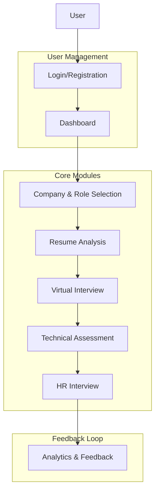
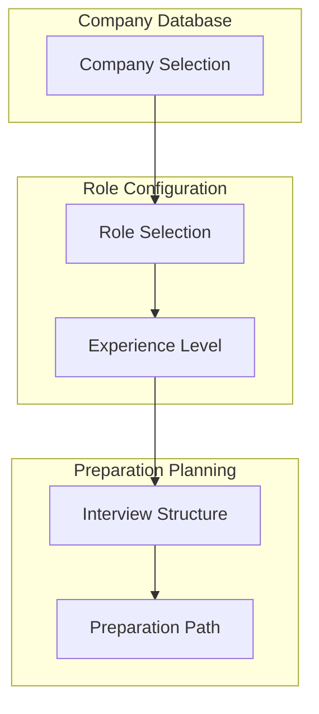
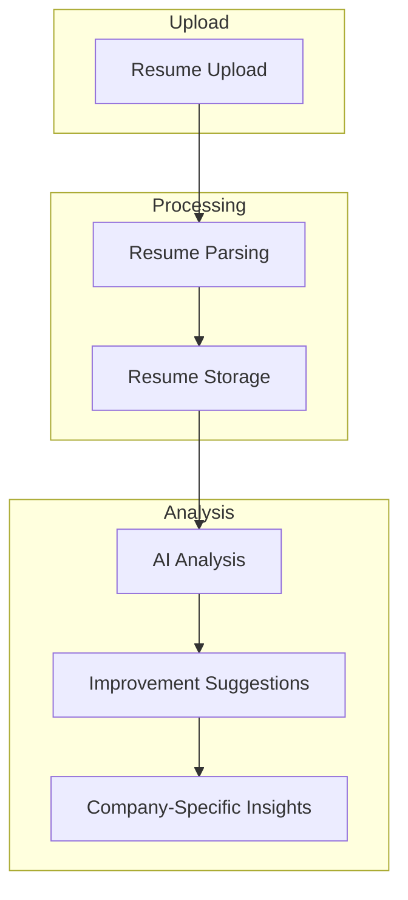
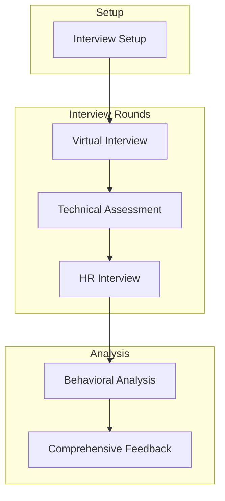
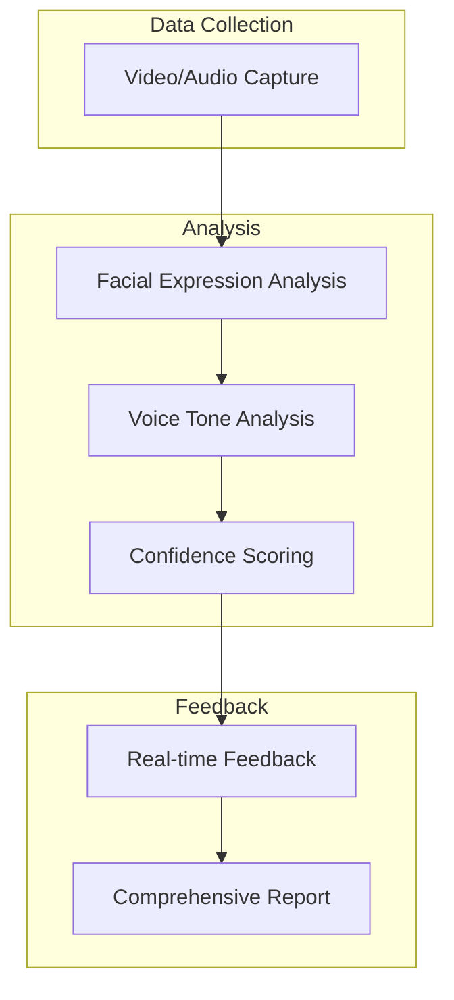
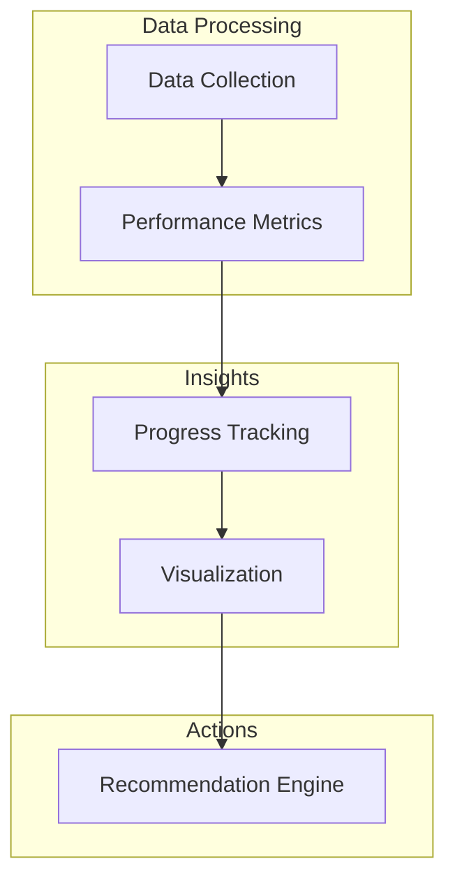

# AI-Powered Interview Preparation System (AIPS) - Comprehensive Todo List

This document outlines a structured approach to building the AI-Powered Interview Preparation System (AIPS) as described in the project documentation. The todo list is organized by phases, with each phase containing detailed tasks and implementation guidelines.

## System Overview

## User Flow

The AIPS system follows a sequential flow where users progress through different modules in a logical order:

1. **Initial Access**
   - On startup, the system displays a login/registration form
   - New users register with email, password, and basic profile information
   - Existing users log in with credentials
   - Upon successful authentication, users are directed to their dashboard

2. **User Dashboard**
   - First-time users are prompted to select a target company and role
   - The dashboard provides navigation to all system modules
   - Progress indicators show completion status of each module

3. **Module Progression**
   - Company & Role Selection → Resume Analysis → Virtual Interview → Technical Assessment → HR Interview → Analytics & Feedback
   - Each module unlocks after completing the previous one
   - Users can revisit completed modules to refine their preparation

4. **Feedback Loop**
   - After each module, users receive feedback and improvement suggestions
   - Analytics dashboard updates with new data after each completed activity

## Phase 1: Foundation - User Management & System Setup

### 1.1 Project Setup 
- [x] Initialize project repository with Git
- [x] Set up React 18 frontend with Vite
- [x] Configure Tailwind CSS for styling
- [x] Set up Express.js backend with TypeScript
- [x] Configure SQLite database with Prisma ORM
- [x] Implement JWT-based authentication
- [x] Configure ESLint and Prettier for code quality
- [ ] Set up Docker for isolated code execution environment (for technical assessment)

### 1.2 User Management Module 
- [x] Design and implement user registration form
- [x] Create login functionality with JWT authentication
- [x] Create basic user dashboard
- [x] Implement session management and authentication state persistence
- [ ] Complete dashboard design with navigation to all system modules
- [ ] Implement password reset functionality
- [ ] Design user profile management interface
- [ ] Implement user settings and preferences
- [x] Set up local storage for user data persistence
- [x] Design first-time user onboarding flow with company selection prompt
- [x] Create module access control based on user progress

### 1.3 Database Schema 
- [x] Design basic user profile schema
- [x] Create company and role schema
- [ ] Design interview session schema
- [ ] Implement technical assessment results schema
- [ ] Create behavioral analysis metrics schema
- [x] Design progress tracking and analytics schema
- [x] Implement user flow state tracking schema

## Phase 2: Company & Role Selection Module

### 2.1 Company Database
- [x] Create database schema for major tech companies (TCS, Infosys, Microsoft, Google, Flipkart, Amazon)
- [x] Design company profile interface with logos and basic information
- [x] Implement company selection interface with search functionality

### 2.2 Role Configuration
- [x] Design role/position selection interface for each company
- [x] Implement experience level selection (New Graduate/Fresher, Junior, Mid, Senior)

## Phase 3: Resume Analysis

### 3.1 Resume Upload Interface
- [x] Create resume upload interface with drag-and-drop functionality
- [x] Implement file type validation and size restrictions
- [x] Design upload progress indicators
- [x] Create resume preview functionality
- [x] Implement resume storage in database with hybrid local/server approach
- [x] Design resume version management interface
- [x] Create resume deletion and replacement functionality

### 3.2 Resume Parser
- [x] Implement resume upload interface with drag-and-drop functionality
- [x] Add file validation for PDF and DOCX formats
- [x] Create parsing engine for PDF using PDF.js
- [x] Create parsing engine for DOCX using docx-parser
- [x] Implement section identification (Education, Experience, Skills)
- [x] Design format analysis to check resume layout and structure
- [x] Create parsing progress indicators
- [x] Implement error handling for malformed documents

### 3.3 Resume Storage and Version Management
- [x] Design database schema for storing resumes
- [x] Implement resume storage in local database
- [x] Create version management interface
- [x] Add functionality for resume deletion and replacement
- [x] Implement resume comparison between versions
- [ ] Add export functionality for resumes
- [x] Implement hybrid storage approach (local + database)
- [x] Create synchronization mechanism between local and server storage

### 3.4 Resume Analysis System
- [x] Implement initial mockup analysis system for resume evaluation
- [x] Create visualization for resume strengths and weaknesses
- [x] Design loading indicators for analysis process
- [x] Implement progress tracking during analysis
- [x] Create mechanism to store analysis results in both local storage and database
- [ ] Document Processing Integration
  - [ ] Implement pdfplumber and pdf2image for PDF parsing
  - [ ] Add pytesseract for OCR backup
  - [ ] Integrate docx-parser for DOCX files
  - [ ] Add fallback text extraction for problematic files
- [ ] Gemini API Integration
  - [ ] Set up environment and API key configuration
  - [ ] Create robust error handling for API calls
  - [ ] Implement rate limiting and request management
  - [ ] Design backup strategy for API failures

### 3.5 AI-Powered Analysis
- [x] Replace manual analysis with Gemini API integration
- [ ] Enhanced Resume Processing
  - [ ] Section identification (Education, Experience, Skills)
  - [ ] Contact information extraction
  - [ ] Project and achievement parsing
  - [ ] Technical skills categorization
- [ ] Smart Analysis System
  - [ ] Design comprehensive analysis prompts
  - [ ] Create role-specific evaluation criteria
  - [ ] Implement company culture matching
  - [ ] Add experience level assessment
- [ ] Advanced Scoring System
  - [ ] Generate detailed section-wise scores
  - [ ] Calculate skill match percentages
  - [ ] Assess experience relevance
  - [ ] Evaluate project impact
- [ ] Feedback Generation
  - [ ] Create actionable improvement points
  - [ ] Generate skill enhancement roadmap
  - [ ] Suggest certification paths
  - [ ] Provide format optimization tips

### 3.6 Resume Improvement Module
- [x] Design actionable feedback generation system
- [x] Implement suggestion engine for missing skills or experiences
- [x] Create company-specific resume optimization tips
- [x] Implement before/after comparison visualization
- [x] Design simple resume editor with improvement suggestions
- [x] Create "Continue to Virtual Interview" button to guide users to next phase
- [ ] Enhance feedback system to use AI-generated company-specific insights
- [ ] Implement personalized improvement roadmap generation

## Phase 4: Interview Modules

### 4.1 Interview Dataset Creation
- [ ] Create structured dataset schema with attributes (Question, Role, Company, Round, Answer)
- [ ] Collect company-specific interview questions for major companies (TCS, Infosys, Microsoft, Google, etc.)
- [ ] Gather HR round questions with expected response patterns
- [ ] Compile behavioral interview questions with evaluation criteria
- [ ] Create sample answers for technical questions
- [ ] Design dataset with "All" company tag for generic questions
- [ ] Implement data validation and quality control processes
- [ ] Create data augmentation techniques for expanding the dataset

### 4.2 Interview Model Training
- [ ] Select base models for fine-tuning (transformer-based models)
- [ ] Implement fine-tuning pipeline for interview question generation
- [ ] Create company-specific question generation models
- [ ] Design round-specific models (Virtual, Technical, HR)
- [ ] Create evaluation response model for technical answers
- [ ] Design model compression for browser-based deployment
- [ ] Implement WebAssembly optimization for local processing
- [ ] Create model evaluation metrics and testing framework

### 4.3 Interview Setup
- [ ] Design virtual interview room interface
- [ ] Implement webcam and microphone access
- [ ] Create interview type selection (Virtual, Technical, HR)
- [ ] Design company-specific interview configuration
- [ ] Implement interview session recording
- [ ] Create pre-interview checklist and guidelines
- [ ] Design interview duration settings
- [ ] Implement real-time behavioral analysis initialization

### 4.4 Virtual Interview Module
- [ ] Implement initial greeting and introduction by AI interviewer
- [ ] Create personal background question generation
- [ ] Design education background discussion flow
- [ ] Implement project experience question generation
- [ ] Create adaptive follow-up questions based on responses
- [ ] Design personality assessment questions
- [ ] Implement response evaluation for communication skills
- [ ] Create transition to technical assessment

### 4.5 Technical Assessment Module
- [ ] Create database schema for technical problems
- [ ] Implement company-specific problem categorization
- [ ] Design difficulty levels (Easy, Medium, Hard)
- [ ] Create problem description format with examples
- [ ] Implement test case generation for problem validation
- [ ] Design problem selection algorithm based on company and role
- [ ] Create problem browsing interface with filters
- [ ] Implement Monaco Editor for code editing
- [ ] Create language selection (Java, Python, C++, JavaScript)
- [ ] Design syntax highlighting and code formatting
- [ ] Implement code execution environment
- [ ] Create test case runner with input/output validation
- [ ] Design performance metrics collection (time, space complexity)
- [ ] Implement code saving and version history
- [ ] Create automated test case validation
- [ ] Implement code quality analysis
- [ ] Design performance metrics visualization
- [ ] Create feedback generation based on solution quality
- [ ] Implement company-specific evaluation criteria
- [ ] Design improvement suggestions for suboptimal solutions
- [ ] Create transition to HR interview

### 4.6 HR Interview Module
- [ ] Design HR interview interface
- [ ] Implement company-specific HR question generation
- [ ] Create situational judgment question set
- [ ] Design cultural fit assessment questions
- [ ] Implement salary expectation and negotiation simulation
- [ ] Create work preference and availability questions
- [ ] Design career goal alignment assessment
- [ ] Implement response evaluation for HR questions
- [ ] Create interview conclusion and next steps guidance

## Phase 5: Behavioral Analysis

### 5.1 Multi-Modal Analysis
- [ ] Implement facial expression analysis using deepface library
- [ ] Create emotion detection pipeline (happy, sad, angry, fear, surprise, neutral)
- [ ] Design confidence measurement based on facial expressions
- [ ] Implement eye contact tracking and analysis
- [ ] Create voice tone analysis using Web Speech API
- [ ] Design speech pattern analysis (pace, clarity, filler words)
- [ ] Implement real-time feedback indicators during interview
- [ ] Create comprehensive behavioral analysis dashboard
- [ ] Design improvement suggestions for behavioral aspects
- [ ] Implement comparison with benchmark metrics
- [ ] Create continuous monitoring throughout all interview rounds
- [ ] Design privacy-focused processing of facial and voice data
- [ ] Implement local processing of all behavioral data

### 5.2 API Integration
- [ ] Implement Gemini API integration for enhanced capabilities
- [ ] Create fallback mechanisms when local models are insufficient
- [ ] Design hybrid approach combining fine-tuned models and APIs
- [ ] Implement context management for API requests
- [ ] Create caching system for API responses
- [ ] Design cost optimization strategies for API usage
- [ ] Implement seamless switching between local models and APIs

## Phase 6: Analytics & Comprehensive Feedback

### 6.1 Data Collection
- [ ] Design analytics data schema
- [ ] Implement session-based data collection
- [ ] Create module-specific performance metrics
- [ ] Design overall preparation score calculation
- [ ] Implement data aggregation from all modules
- [ ] Create data export functionality
- [ ] Design privacy-focused data storage

### 6.2 Analytics Dashboard
- [ ] Create visual performance dashboard
- [ ] Implement progress tracking visualization
- [ ] Design company-specific readiness indicators
- [ ] Create module completion status tracking
- [ ] Implement performance comparison with peers (anonymized)
- [ ] Design time-based improvement tracking
- [ ] Create printable/shareable reports

### 6.3 Comprehensive Feedback System
- [ ] Create detailed interview performance report
- [ ] Implement strength and weakness identification across all modules
- [ ] Design actionable improvement suggestions
- [ ] Create company-specific feedback based on known criteria
- [ ] Implement before/after comparison for repeated interviews
- [ ] Design progress tracking visualization
- [ ] Create exportable interview summary
- [ ] Implement personalized improvement suggestions
- [ ] Create resource recommendation system
- [ ] Design focused practice area identification
- [ ] Implement company-specific preparation recommendations
- [ ] Create adaptive learning path based on performance
- [ ] Design notification system for practice reminders
- [ ] Implement goal setting and achievement tracking

## Phase 7: Deployment & Optimization

### 7.1 Performance Optimization
- [ ] Implement code splitting for faster loading
- [ ] Create progressive web app capabilities
- [ ] Design offline functionality for key features
- [ ] Implement caching strategies for resources
- [ ] Create optimized build process
- [ ] Design lazy loading for non-critical components
- [ ] Implement performance monitoring

### 7.2 Security Implementation
- [ ] Create comprehensive security audit
- [ ] Implement data encryption for sensitive information
- [ ] Design secure authentication flow
- [ ] Create privacy policy and terms of service
- [ ] Implement GDPR compliance features
- [ ] Design data retention policies
- [ ] Create security documentation

### 7.3 Testing & Quality Assurance
- [ ] Implement unit testing for all modules
- [ ] Create integration testing suite
- [ ] Design end-to-end testing scenarios
- [ ] Implement automated testing pipeline
- [ ] Create user acceptance testing plan
- [ ] Design performance testing methodology
- [ ] Implement continuous integration/deployment

### 7.4 Documentation
- [ ] Create comprehensive user documentation
- [ ] Design in-app help system
- [ ] Implement tooltips and guided tours
- [ ] Create developer documentation
- [ ] Design API documentation
- [ ] Implement changelog and release notes
- [ ] Create maintenance documentation