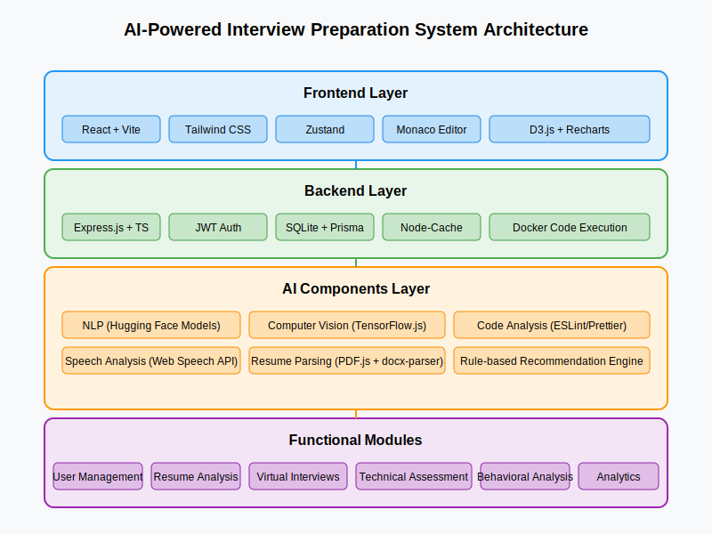
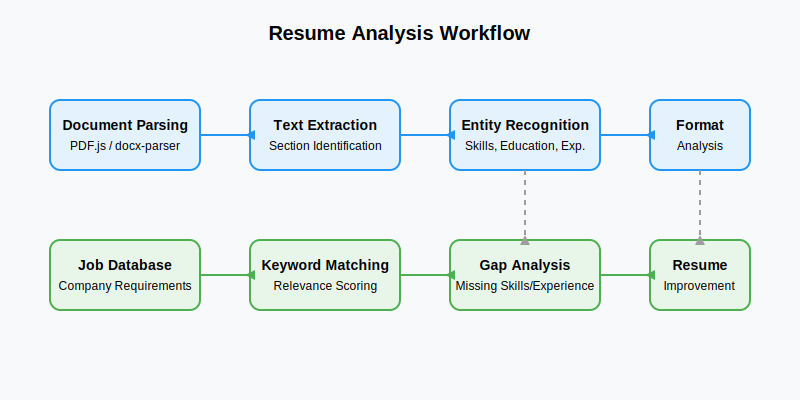
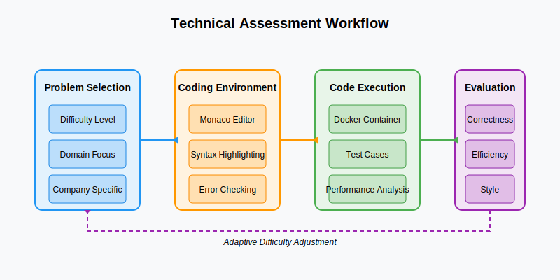
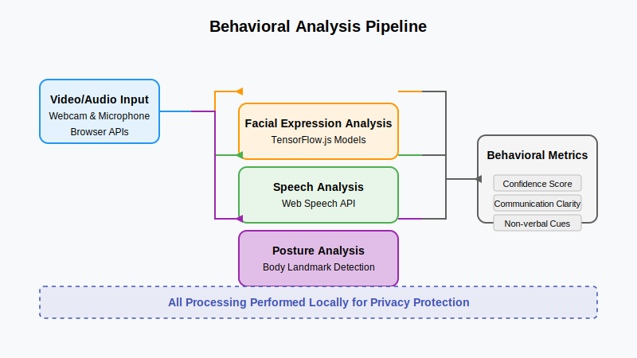
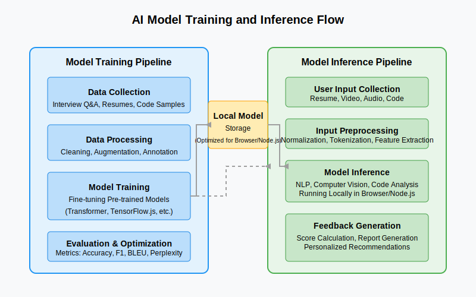

# AI-Powered Interview Preparation System (AIPS)

## Overview

The AI-Powered Interview Preparation System (AIPS) is a revolutionary platform designed to transform the way candidates prepare for technical interviews. Using cutting-edge AI technologies and modern web development practices, AIPS provides a comprehensive, interactive, and privacy-focused interview preparation experience.

## System Architecture

Our system is built on a modern tech stack that prioritizes performance, privacy, and real-time interaction:

- **Frontend**: React 18, Vite, Tailwind CSS, Zustand
- **Backend**: Express.js, TypeScript, SQLite with Prisma
- **AI Components**: TensorFlow.js, Web Speech API, WebAssembly
- **Privacy**: Local storage encryption, WebAssembly for local processing

## Key Features

### 1. Resume Analysis
Our advanced resume parsing and analysis system helps candidates optimize their resumes for maximum impact. Using natural language processing, it provides targeted feedback on content alignment with job requirements.

### 2. Technical Assessment
The system includes a sophisticated technical assessment module that evaluates coding skills through real-time code execution and analysis.

### 3. Behavioral Analysis
AIPS employs multi-modal analysis combining facial expression recognition, speech analysis, and natural language processing to provide comprehensive feedback on behavioral aspects.

### 4. AI Model Integration
Our system integrates multiple AI models that work together to provide a holistic interview preparation experience.

## Privacy and Security

AIPS prioritizes user privacy by implementing:
- Local data processing using WebAssembly
- Client-side AI model execution
- Encrypted local storage
- No cloud dependencies for core functionalities

## Research Background

This project is based on extensive research in:
- Natural Language Processing using transformer-based models
- Facial Expression Recognition using CNNs
- Speech Recognition and Analysis
- Multi-modal Data Integration
- Privacy-Preserving AI Applications

## Authors

- Mahesh Sharan (122111974)
- Pranav Patil (12210496)

School of Computer Science  
Lovely Professional University, Punjab, India

## License

MIT License - see the [LICENSE](LICENSE) file for details
